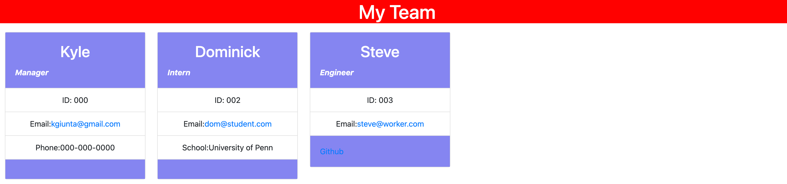

# TeamProfile

## Description

This application creates HTML cards based on the users inputs from node in the integrated terminal.

This application builds out a company organization chart and can have dynamic github links as well as emails that open in your default email browser.

## Table of Contents (Optional)

If your README is long, add a table of contents to make it easy for users to find what they need.

- [Installation](#installation)
- [Usage](#usage)
- [Credits](#credits)
- [License](#license)
- [Tests](#tests)

## Installation

Please go to https://github.com/kgiunta/TeamProfile for the full library of items.

or visit https://kgiunta.github.io/TeamProfile/ to visit the page this application created

## Usage

Please install the package in the application by using npm install.

Then use node to run the application's tests as well as cycle through the prompts before generate HTML cards.

Below is an image of the HTML file this application created.

Please see the video walk through in the following link: https://youtu.be/OS7Q9FIxyVA

## Credits

Jehyun Jung | Penn LPS Tutor

## License

## Tests

Please reference the test folder in the applications file structure.
